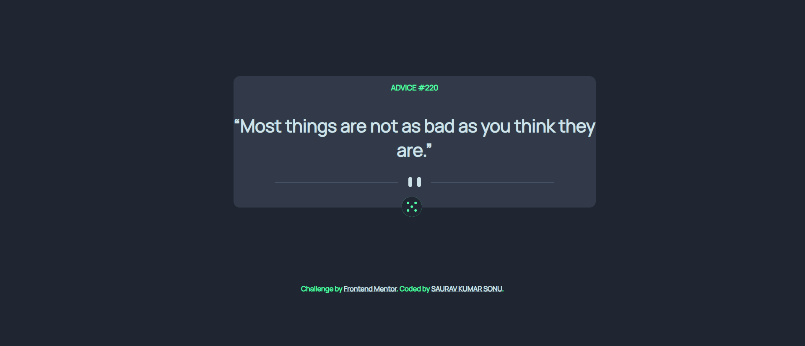

# Frontend Mentor - Advice generator app solution

This is a solution to the [Advice generator app challenge on Frontend Mentor](https://www.frontendmentor.io/challenges/advice-generator-app-QdUG-13db). Frontend Mentor challenges help you improve your coding skills by building realistic projects.

## Table of contents

- [Overview](#overview)
  - [The challenge](#the-challenge)
  - [Screenshot](#screenshot)
  - [Links](#links)
- [My process](#my-process)
  - [Built with](#built-with)
  - [What I learned](#what-i-learned)
  - [Useful resources](#useful-resources)
- [Author](#author)


**Note: Delete this note and update the table of contents based on what sections you keep.**

## Overview

### The challenge

Users should be able to:

- View the optimal layout for the app depending on their device's screen size
- See hover states for all interactive elements on the page
- Generate a new piece of advice by clicking the dice icon

### Screenshot



### Links

- Solution URL: [GITHUB Link](https://github.com/ItsmeSauravSonu/advice-generator-app)
- Live Site URL: [NETLIFY LINK](https://advice-generator-sks.netlify.app/)

## My process

### Built with

- Semantic HTML5 markup
- CSS custom properties
- Flexbox
- Media Queries
- JavaScript API call

### What I learned

I learnt call an API through fetch() in JavaScript;


``` fetch(url)
        .then(response => response.json())
        .then(data => {
          console.log(data)
        }
```


### Useful resources

- [Resource 1](https://stackoverflow.com/questions/1875852/how-can-i-define-colors-as-variables-in-css)
- [Resource 2](https://www.digitalocean.com/community/tutorials/how-to-use-the-javascript-fetch-api-to-get-data) - This is an amazing article which helped me finally understand to fetch API. I'd recommend it to anyone still learning this concept.
- [Resource 3](https://css-tricks.com/snippets/css/a-guide-to-flexbox/)


## Author

- Website - [SAURAV KUMAR SONU](https://www.your-site.com)
- Frontend Mentor - [@ItsmeSauravSonu](https://www.frontendmentor.io/profile/ItsmeSauravSonu)
- Twitter - [@saurav_s07](https://rb.gy/0tkam0)


